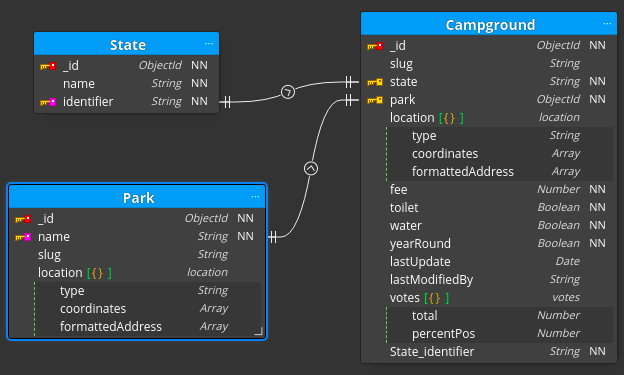

## Backend Readme

    
 General Structure

    <ul style="list-style-type:none;">
        <li>
            

                
 config

                <ul style="list-style-type:none;">
                    <li>db.js</li>
                    <li>blank.env</li>
                </ul>
            

        </li>
        <li>
            

                
controllers

                <ul style="list-style-type:none;">
                    <li>
                        

                            
v1

                            <ul style="list-style-type:none;">
                                <li>auth.js</li>
                                <li>campgrounds.js</li>
                                <li>users.js</li>
                            </ul>
                        

                    </li>
                </ul>
            

        </li>
        <li>
            

                
middleware

                <ul style="list-style-type:none;">
                    <li>async.js</li>
                    <li>auth.js</li>
                    <li>error.js</li>
                    <li>generalQuery.js</li>
                    <li>xssCleanIn.js</li>
                </ul>
            

        </li>
        <li>
            

                
models

                <ul style="list-style-type:none;">
                    <li>
                        

                            
__tests__

                            <ul style="list-style-type:none;">
                                <li>State.test.js</li>
                                <li></li>
                            </ul>
                        

                    </li>
                    <li>Campground.js</li>
                    <li>Parks.js</li>
                    <li>Photo.js</li>
                    <li>State.js</li>
                    <li>User.js</li>
                </ul>
            

        </li>
        <li>
            

                
public

                <ul style="list-style-type:none;">
                    <li>
                        

                            
uploads

                            <ul style="list-style-type:none;">
                                <li>photo-camp-no-photo.jpg</li>
                                <li>photo-user-no-photo.jpg</li>
                            </ul>
                        

                    </li>
                </ul>
            

        </li>
        <li>
            

                
routes

                <ul style="list-style-type:none;">
                    <li>
                        

                            
v1

                            <ul style="list-style-type:none;">
                                <li>auth.js</li>
                                <li>campground.js</li>
                                <li>users.js</li>
                            </ul>
                        

                    </li>
                </ul>
            

        </li>
        <li>
            

                
utils

                <ul style="list-style-type:none;">
                    <li>ErrorResponse.js</li>
                    <li>geocoder.js</li>
                    <li>sendEmail.js</li>
                </ul>
            

        </li>
        <li>.babelrc</li>
        <li>app.js</li>
        <li>app.test.js</li>
        <li>server.js</li>
    </ul>

 ERD

The image below represents the structure of data as received by a user.

